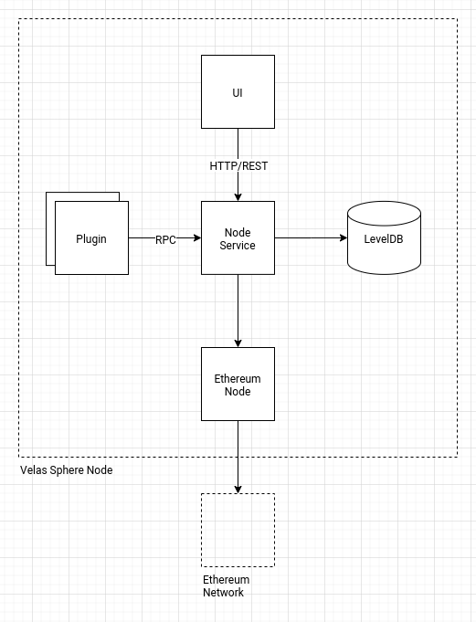

# Velas Sphere

Velas Sphere is an opensource initiative and ecosystem, allowing usual customers to perform resource-demanding tasks using storage, CPU, and GPU sharing concepts.

## Status

This repository is an active WIP.

## Architecture 

Velas Sphere is a P2P network of nodes communicating between each other using gRPC. Each node can act as a requester and provider (for task execution and file storage), has some plugins (which are designed for supporting different kind of tasks), and provides a RESTful API for UI support. The node and storage data is stored in a LevelDB database. In order to allow plugins to be written in any general-purpose language, they are physically decoupled from the node service using gRPC again, and each plugin is basically a separate service.

Here is how the node architecture looks like:



## Economy

Requesters pay providers for the shared resources using Ethereum Network and smart-contracts.

## Building, Installing and Running a Velas Sphere node locally

Since the whole Velas Sphere node service is implemented using Golang exclusively, it is very simple to build and run. It also comes with a simple plugin for demo purposes.

```bash
$ cp config-local-example.json config.json
$ CGO_ENABLED=0 go build .
$ ./velas-sphere plugin
$ ./velas-sphere node
```

Dockerized version uses multi-stage dockerfile for multiple lightweight images, so it looks like this:

``` sh
$ cp config-docker-example.json config.json
$ mkdir db
$ docker build --target velas-sphere-plugin -t velas-sphere-plugin-local .
$ docker build --target velas-sphere-node -t velas-sphere-node-local .
$ docker-compose up -d
```

You can request task execution via a simple RESTful API. The following example shows how to request task execution on a dockerized deployment using a single node:

``` sh 
curl -X POST 127.0.0.1:3000/task -d \
'{
    "target": "node:8081", 
    "id": "1",
    "input": "hello"
}'
```

The response will be the following:

```json
{"id":"1","output":"world"}
```

File storage can be requested like this:

```sh
curl -X POST 127.0.0.1:3000/file -d \
'{
    "target": "node:8083",
    "name": "my_awesome_file",
    "data": "TXkgYXdlc29tZSBsb25nIGxvbmcgbG9uZyBzdHJpbmch"
}'
```

It gets encrypted and sent to the remote node (in our case it is `node:8083`). The encryption key is generated using secure crypto random and stored in the LevelDB of the requester along with some other metadata like verification and get-back tokens etc.

You can download the file using the following request:

```sh
curl -X GET 127.0.0.1:3000/file -d \
'{
    "target": "127.0.0.1:8083",
    "id": "/my_awesome_file"
}'
```

Consider storing the file on several remote hosts to ensure redundancy.

It is not recommended to overwrite files.

## Contribution Guideline

Basic contribution rules are:

1. Each package serves a single signature. It can contain both instances or their constructors accepting a config
2. All packages are located in the `internal` folder
3. `"internal/resources"` is a special package since it contains the Protobuf definition and autogenerated files

### How to write a plugin

Technically a plugin is a simple gRPC server responsible for handling task execution requests. At the moment, both the proto and node service support only a single plugin. You can implement Your own by generating the gRPC interfaces for a language of choice.

Example for Golang:

```sh
$ cd internal/resources
$ protoc --go_out=plugins=grpc:. *.proto
```

Example for Python:

```sh
$ pip install grpcio-tools
$ cd internal/resources
$ python -m grpc_tools.protoc -I. --python_out=. --grpc_python_out=. proto.proto
```

Further information can be found at the original source: https://grpc.io/docs/tutorials/

#### Local deployment

After You have implemented the server interface, You can start the listener at any port You like. The default is `:8082`, so make sure the `config.json` contains the correct host and port.

#### Dockerized deployment

In the case You use the dockerized version, here are a few more steps to deploy it:

- Rebuild the docker images of the Velas Sphere Node (or provide a volume) to make it use the new config
- Write a Dockerfile for Your server
- Build and tag Your image (`docker build -t myimage .`)
- Add the image to the `docker-compose.yaml`
- Stop the old node and plugin services (`docker-compose down`)
- Run Your own plugin and node (`docker-compose up`)

Verify Your plugin works by sending a proper task execution request via `curl`.